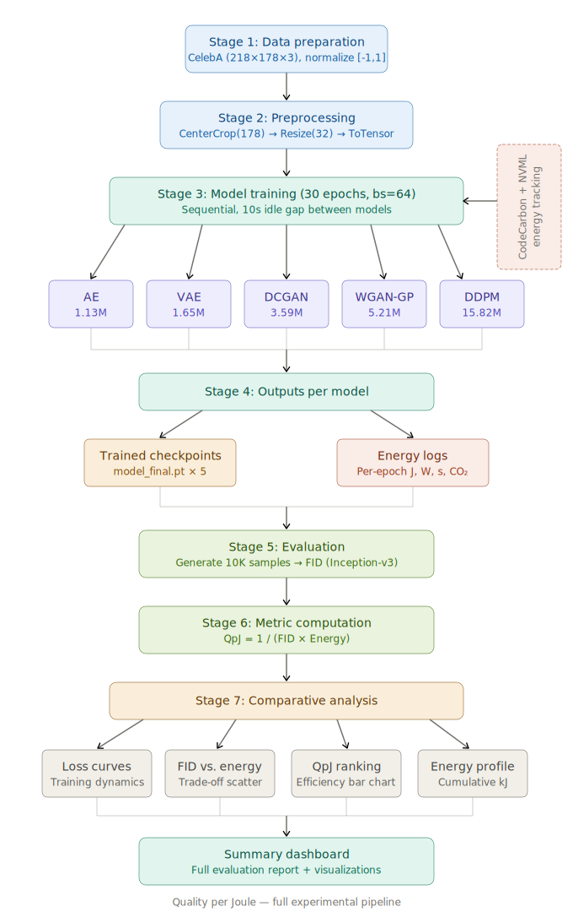

# Quality per Joule
### A Comparative Study of Energy Efficiency in Autoencoders, VAEs, GANs, WGAN-GPs, and Diffusion Models

*ECE 7650 – Deep Generative Modeling: Theory & Application | Winter 2026*

---

## Pipeline




The experiment spans seven stages: data preparation → preprocessing → model training with energy tracking → per-model output collection → FID evaluation → QpJ metric computation → comparative analysis.

---

## Models & Results

| Model    | FID ↓     | Energy (kJ) | QpJ (×10⁻⁷) ↑  |
|----------|:---------:|:-----------:|:--------------:|
| AE       | 33.45     | 103.9       | **2.900**      |
| VAE      | 117.81    | 108.3       | 0.800          |
| DCGAN    | **15.20** | 1,115.1     | 0.600          |
| WGAN-GP  | 20.52     | 4,466.2     | 0.100          |
| DDPM     | 20.30     | 1,098.0     | 0.400          |

**Quality per Joule** is defined as **`QpJ = 1 / (FID × Energy_J)`** — higher is better.

---

## Setup

**Requirements:** Python 3.10, CUDA-capable GPU (tested on RTX 2080 SUPER and Linux OS)

```bash
# Clone the repository
git clone https://github.com/masud70/Quality-Per-Joule.git
cd Quality-Per-Joule

# Install dependencies
pip install torch torchvision torchmetrics codecarbon pynvml tqdm matplotlib numpy

# or install from the requirements
pip install -r requirements.txt
```

---

### Note

Due to size constraints, the dataset and trained checkpoints are not included in either the zip file or this repository. The automatic download functionality in the code has been disabled, as it can occasionally fail due to Google Drive access issues.

To run the project, please manually download the dataset from the link below and extract it into the ./data/celeba/celeba directory. This will create a folder named img_align_celeba containing all 202,599 images. After that, you can train and execute the project using the scripts provided below.

Dataset Link: [CelebA Dataset](https://drive.google.com/file/d/0B7EVK8r0v71pZjFTYXZWM3FlRnM/view?usp=drive_link&resourcekey=0-dYn9z10tMJOBAkviAcfdyQ)

---

## Usage

```bash
# Run the full pipeline (train all models → evaluate → analyze)
python run_all.py

# Skip training; run evaluation and analysis only
python run_all.py --skip-training

# Train a single model (ae | vae | dcgan | wgan_gp | ddpm)
python run_all.py --only ddpm
```

Outputs — checkpoints, energy logs, generated samples, and analysis plots — are saved automatically.

---

## © 2026 Md. Masud Mazumder.
This work, **Quality per Joule**, was prepared as part of ECE 7650, Winter 2026.
